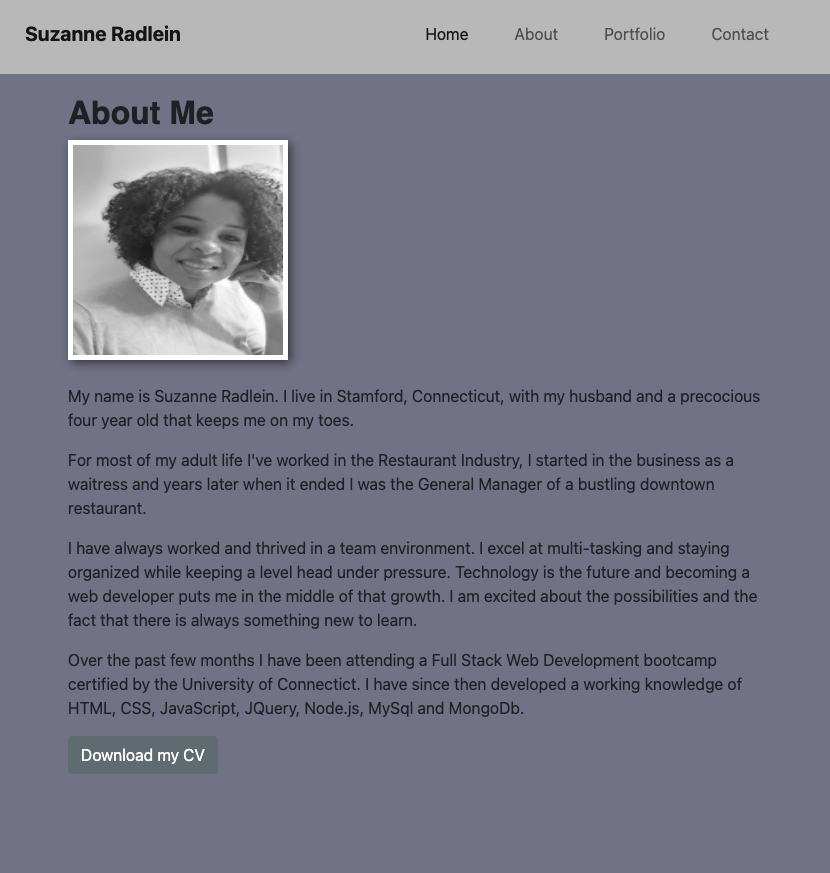
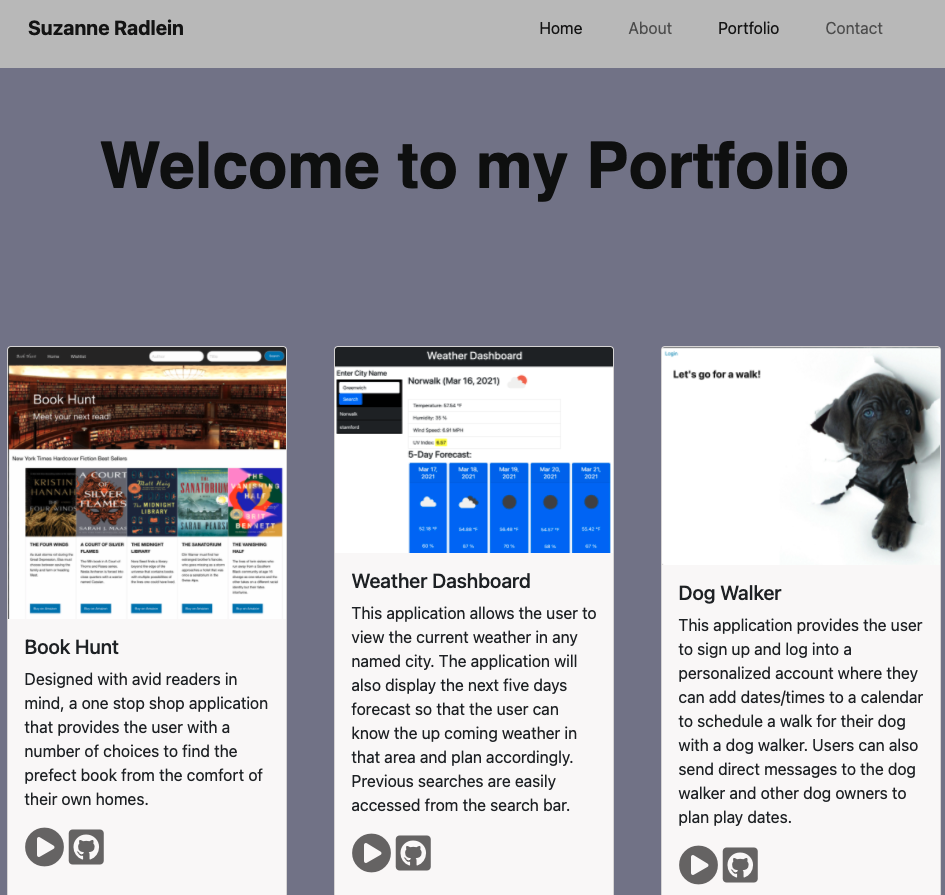
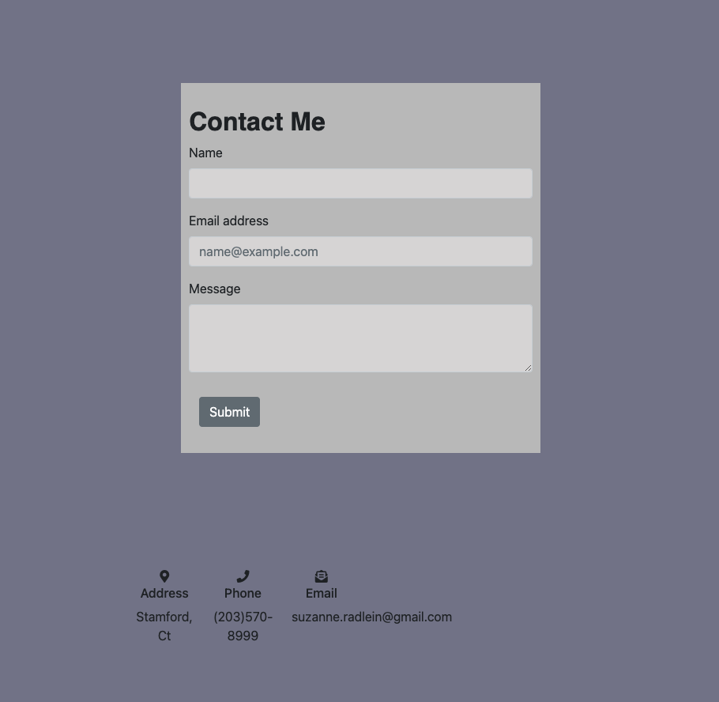

# My Responsive Portfolio

## Features
A mobile ready responsive portfolio, with links to three separate pages. There is an About Me page, a Portfolio page which showcases and deploys three projects and a Contact page. Each page has links to my information.

## Technologies Used
1. HTML
2. CSS
3. Bootstrap

## Screenshots of Portfolio

#### About Me

#### Portfolio
Three projects are featured in portfolio

### Contact Me
My details are listed at the bottom of each page

## View deployed Portfolio
* https://srad25.github.io/ResponsivePortfolio
* https://github.com/srad25/ResponsivePortfolio

## Contact
https://www.github.com/srad25

 
 